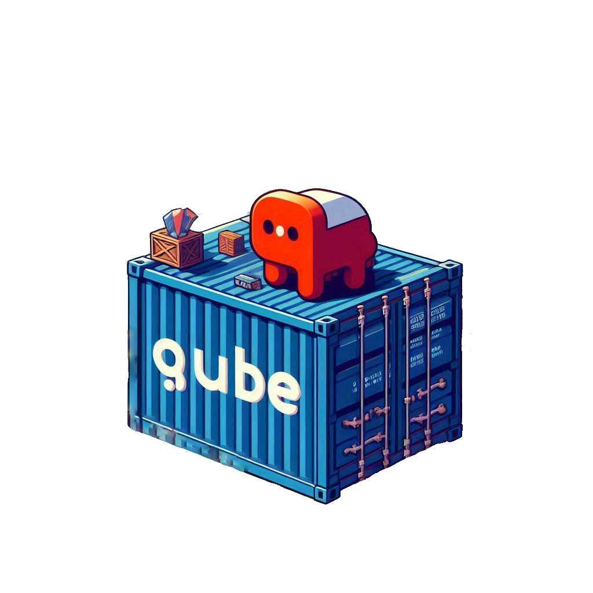

[](https://github.com/Voyrox/Qube/graphs/contributors)
[](https://github.com/Voyrox/Qube/actions)

<p align="center">
  
</p>

## Features
- Lightweight and fast container runtime.
- Written in Rust for memory safety and performance.
- Supports basic container isolation using Linux namespaces.

## Motivation
Qube aims to provide a lightweight, secure, and efficient container runtime. Rust's memory safety and performance make it an ideal choice for implementing container runtimes. Qube is designed to be simple yet powerful, with a focus on extensibility and security.

# 🚀 Quick Start
> [!TIP]
> You can immediately set up your environment with youki on GitHub Codespaces and try it out.  
>
> [](https://codespaces.new/containers/Qube?quickstart=1)
> ```console
> $ cargo build --release
> $ sudo ln -s /mnt/e/Github/Qube/target/release/Qube /usr/local/bin/Qube
> $ cp qubed.service /etc/systemd/system/qubed.service
> $ systemctl daemon-reload
> ```

# 📍 Status of Qube

### Manage Containers
- Run a container

  ### Prebuilt Images
  - `Ubuntu24_Multi`: A multi-purpose Ubuntu 24.04 container with Node.js, Rust, and Python3 pre-installed.
  - `Ubuntu24_NODE`: A Node.js container based on Ubuntu 24.04.
  - `Ubuntu24_RUST`: A Rust container based on Ubuntu 24.04.
  - `Ubuntu24_PYTHON`: A Python3 container based on Ubuntu 24.04.
  - `Ubuntu24_GOLANG`: A Go container based on Ubuntu 24.04.
  - `Ubuntu24_JAVA`: A Java container based on Ubuntu 24.04.

  Registers a container (with a placeholder PID) and starts it automatically via the daemon. | Add `--isolation` to disable the network namespace.
  ```bash
  sudo Qube run --image Ubuntu24_Multi -cmd "<cmd>"
  # e.g.
  sudo Qube run --image Ubuntu24_NODE --ports 3000 --cmd "npm i && node index.js"
  ```

  ### QML File
  The QML file is used to define the configuration and behavior of your containers. It allows you to specify various settings such as the container's name, image, command, ports, and more. Here is an example of a QML file:

  ```yaml
  container:
    # The base system image to use for the container.
    system: Ubuntu24_NODE

    # Ports to be exposed by the container.
    ports:
      - "3000"

    # Command to run inside the container.
    cmd:
      - npm install
      - node index.js

    # Optional: Enable network isolation for the container.
    isolated: false

    # Optopnal: Add Enviromental variables to the container.
    enviroment:
      - SUPER_TOKEN = "1234567890abcdefghijklmnopqrstuvwxyz"

    # Optional: Volumes to mount into the container.
    volumes:
      - host_path: "/path/on/host"
        container_path: "/path/in/container"

    # Optional: Enable debug mode for more verbose output.
    debug: false
  ```

  To use the QML file, you need to run the `run` command in the same directory as the QML file. The `run` command will automatically detect the QML file and use it to create the container.
  ```bash
  sudo Qube run
  ```
  <image src="./images/download.png" style="display: block;margin-left: auto;margin-right: auto;">
  <image src="./images/image.png" style="display: block;margin-left: auto;margin-right: auto;">

- List running containers

  Displays all tracked containers, along with their PIDs, uptime, and status.
  ```bash
  sudo Qube list
  ```
  
- Stop a container
  Immediately Stops a container by sending it a SIGKILL.

  ```bash
  sudo Qube stop <pid|container_name>
  ```

- Start a container
  Starts a stopped container.

  ```bash
  sudo Qube start <pid|container_name>
  ```

- Eval a container
  
  Allows you to attach to a container (by name or PID) and run commands as root inside it.
WARNING: Running commands as root inside a container may alter its configuration and pose security risks. Use with caution!

  ```bash
  # Launch an interactive shell in the container:
  sudo Qube eval <container_name|pid>

  # Execute a specific command as root in the container:
  sudo Qube eval <container_name|pid> [command]
  ```

- View container info
  Shows detailed information about a container, such as its name, PID, working directory, command, timestamp, and uptime.

  ```bash
  sudo Qube info <container_name|pid>
  ```
- Snapshot a container
  Creates a snapshot (a compressed tarball) of the container’s filesystem. The snapshot is stored in the container's working directory.

  ```bash
  sudo Qube snapshot <container_name|pid>
  ```
- Run a container based on a dockerfile
  Creates a container based on a Dockerfile. The container is stored in the containers directory.

  ```bash
  sudo Qube docker
  ```

# Custom Images 📦
- Create a custom image
  Creates a custom image from a container. The image is stored in the images directory.

  ### Default Image
  - Node.js
  - Rust
  - Python3

  #### Options
  - `INSTALL_NODE=true` Install Node.js and npm.
  - `INSTALL_RUST=true` Install Rust.
  - `INSTALL_PYTHON=true` Install Python.
  - `INSTALL_GOLANG=true` Install Go.
  - `INSTALL_JAVA=true` Install Java.

 ```bash
 INSTALL_<NAME> ./buildIMG/install_and_pack.sh
 ```

### API

#### `/list
- GET
- Lists all running containers, along with their PIDs, uptime, and status.
  - Response: `{"containers": <containers>}`
  - Example: `curl http://localhost:8080/list`

#### `/stop`
- POST
- Stops a container by sending it a SIGKILL.
  - Request Body: `{"pid": <pid>}`
  - Response: `{"status": "success"}`
  - Example: `curl -X POST -d '{"pid": 1234}' http://localhost:8080/stop`

#### `/start`
- POST
- Starts a stopped container.
  - Request Body: `{"pid": <pid>}`
  - Response: `{"status": "success"}`
  - Example: `curl -X POST -d '{"pid": 1234}' http://localhost:8080/start`

#### `/eval`
- POST
- Allows you to attach to a container (by name or PID) and run commands as root inside it.
  - Request Body: `{"pid": <pid>, "command": <command>}`
  - Response: `{"output": <output>}`
  - Example: `curl -X POST -d '{"pid": 1234, "command": "ls"}' http://localhost:8080/eval`

#### `/info`
- POST
  - Shows detailed information about a container, such as its name, PID, working directory, command, timestamp, and uptime.
    - Request Body: `{"pid": <pid>}`
    - Response: `{"info": <info>}`
    - Example: `curl -X POST -d '{"pid": 1234}' http://localhost:8080/info`

#### `/delete`
- POST
- Deletes a container and its associated resources.
  - Request Body: `{"pid": <pid>}`
  - Response: `{"status": "success"}`
  - Example: `curl -X POST -d '{"pid": 1234}' http://localhost:8080/delete`

# Dependencies
Install the required dependencies:

```bash
sudo apt-get install -y build-essential libseccomp-dev libssl-dev tar
```

### Dev Notes

#### Building the Docs Site
```bash
bundle install
bundle exec jekyll serve
```

#### Reset testing environment
```bash
rm -rf /var/lib/Qube/containers.txt && rm -rf /var/tmp/Qube_containers/Qube-
```

### Roadmap
- [ ] Resource Limiting: Add support for limiting CPU, memory, and disk usage. `sudo Qube run --image Ubuntu24_Multi --cpu 2 --memory 512M --cmd "npm i && node index.js"`
- [ ] Restore: Allow users to save the state of a container and revert to it later. `sudo Qube snapshot restore <snapshot_id>` | `sudo Qube snapshot create <container_name|pid>`
- [ ] Rootless Containers: Add CLONE_NEWUSER and map UID/GIDs to avoid requiring sudo.
- [ ] Security: Integrate seccomp, capabilities, and AppArmor/SELinux for enhanced security.

### Contributing
Your ideas and contributions are welcome! Feel free to open issues or submit pull requests.
