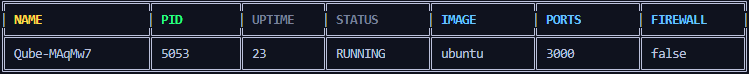
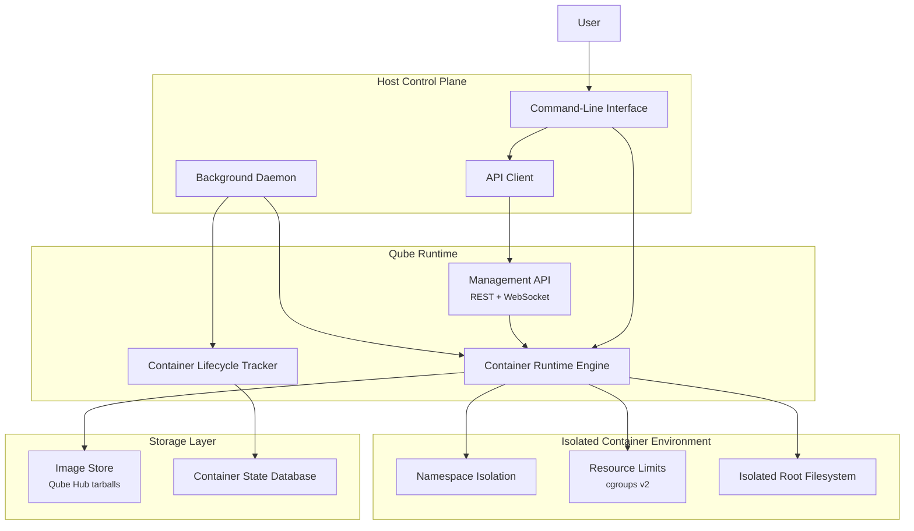

# Qube

<div align="center">


<em>A lightweight Linux container runtime and container manager written in Go.</em>



<a href="https://github.com/Voyrox/Qube/graphs/contributors"></a>
<a href="https://github.com/Voyrox/Qube/actions"></a>
<a href="https://github.com/Voyrox/Qube/blob/main/go.mod"></a>

<a href="https://qubecloud.org/"><strong>Live Demo</strong></a> ·
<a href="https://hub.qubecloud.org/"><strong>Qube Hub</strong></a> ·
<a href="./docs/"><strong>Documentation</strong></a>

</div>

## Overview

Qube lets you run isolated Linux containers from a single Go binary. It provides a Docker-like workflow for pulling images, starting containers, exposing ports, mounting volumes, passing environment variables, snapshotting containers, and executing commands inside running workloads.

Qube can be used from:

- a CLI for local development and systems experiments
- a daemon that monitors and restarts managed containers
- a REST API and WebSocket interface for programmatic container management
- a `qube.yml` config file for repeatable container launches

> **Status:** Qube is an educational and experimental container runtime. It demonstrates Linux namespaces, cgroups v2, filesystem isolation, daemon supervision, and image-based workflows. It is not a drop-in replacement for Docker or containerd.

## Table of Contents

- [Qube](#qube)
  - [Overview](#overview)
  - [Table of Contents](#table-of-contents)
  - [Features](#features)
  - [Architecture](#architecture)
    - [Main components](#main-components)
  - [System Requirements](#system-requirements)
  - [Quick Start](#quick-start)
  - [Build Commands](#build-commands)
  - [CLI Usage](#cli-usage)
    - [Run a container](#run-a-container)
    - [Container lifecycle commands](#container-lifecycle-commands)
  - [Configuration](#configuration)
    - [Recommended `qube.yml`](#recommended-qubeyml)
    - [Config fields](#config-fields)
  - [REST and WebSocket API](#rest-and-websocket-api)
  - [Runtime Internals](#runtime-internals)
    - [Isolation](#isolation)
    - [cgroups v2](#cgroups-v2)
    - [Tracking](#tracking)
    - [Daemon restart behavior](#daemon-restart-behavior)
  - [Testing and Quality](#testing-and-quality)
  - [Troubleshooting](#troubleshooting)
    - [`permission denied`](#permission-denied)
    - [cgroups are not applied](#cgroups-are-not-applied)
    - [daemon is not running](#daemon-is-not-running)
    - [image does not exist locally](#image-does-not-exist-locally)
    - [rebuild from a clean state](#rebuild-from-a-clean-state)
  - [Limitations](#limitations)
  - [Security Notes](#security-notes)
  - [Contributing](#contributing)
  - [License](#license)
  - [Credits](#credits)

## Features

- Lightweight Linux container runtime written in Go
- Linux namespace isolation for PID, mount, network, IPC, and UTS namespaces
- cgroups v2 support for CPU and memory resource controls
- Docker-like CLI workflow
- Background daemon for monitoring and restarting containers
- REST API for container lifecycle operations
- WebSocket support for interactive command execution
- Image pulling from Qube Hub
- Port mapping, volumes, and environment variable support
- `qube.yml` configuration for repeatable launches
- Snapshot support for container state
- Desktop and hub subprojects for UI and image distribution workflows

## Architecture


```mermaid
flowchart TD
    User["User"]

    subgraph ControlPlane["Host Control Plane"]
        CLI["Command-Line Interface"]
        Daemon["Background Daemon"]
        APIClient["API Client"]
    end

    subgraph Runtime["Qube Runtime"]
        Core["Container Runtime Engine"]
        API["Management API<br/><small>REST + WebSocket</small>"]
        Lifecycle["Container Lifecycle Tracker"]
    end

    subgraph Isolation["Isolated Container Environment"]
        Namespaces["Namespace Isolation"]
        Cgroups["Resource Limits<br/><small>cgroups v2</small>"]
        Filesystem["Isolated Root Filesystem"]
    end

    subgraph Storage["Storage Layer"]
        Images["Image Store<br/><small>Qube Hub tarballs</small>"]
        State["Container State Database"]
    end

    User --> CLI
    CLI --> Core
    CLI --> APIClient
    APIClient --> API
    API --> Core

    Daemon --> Lifecycle
    Daemon --> Core

    Core --> Namespaces
    Core --> Cgroups
    Core --> Filesystem
    Core --> Images

    Lifecycle --> State
```

### Main components

| Path | Purpose |
|---|---|
| `main.go` | Entrypoint and CLI dispatch |
| `src/cli/` | CLI commands such as `run`, `list`, `stop`, `pull`, `eval`, `snapshot`, `info`, and `delete` |
| `src/daemon/` | Background monitor that restarts containers and cleans orphaned state |
| `src/api/` | REST API on `127.0.0.1:3030` and WebSocket execution endpoint |
| `src/core/container/` | Runtime implementation: namespace setup, chroot, image extraction, filesystem operations, container startup |
| `src/core/cgroup/` | cgroups v2 CPU and memory resource controls |
| `src/core/tracking/` | Container tracking and persistence in `/var/lib/Qube/containers.txt` |
| `src/config/` | Global paths and test path overrides |
| `src/testutil/` | Helpers for remapping mutable paths in future tests |
| `qube-apps/desktop/` | Electron desktop app |
| `qube-apps/hub/` | Web hub for images and related workflows |

## System Requirements

- Linux only
- Root privileges
- Go 1.21+ for building from source
- cgroups v2 for resource limits
- `tar`, `rsync`, and build tools
- systemd if installing the daemon service through `make install`

Install common dependencies on Ubuntu/Debian:

```bash
sudo apt-get update
sudo apt-get install -y golang build-essential tar rsync make
```

Check cgroups v2:

```bash
mount | grep cgroup2
```

If cgroups v2 is unavailable, Qube can still run containers, but CPU and memory limits may not be applied.

## Quick Start

```bash
git clone https://github.com/Voyrox/Qube
cd Qube
make install
```

Start the daemon:

```bash
sudo systemctl start qubed
```

Pull and run a container:

```bash
sudo qube pull Voyrox:nodejs:25.2.0
sudo qube run --image Voyrox:nodejs:25.2.0 --ports 3000 --cmd "npm install && npm start"
```

Inspect and stop the container:

```bash
sudo qube list
sudo qube info <container_name>
sudo qube stop <container_name>
```

## Build Commands

| Command | Description |
|---|---|
| `make build` | Build the `qube` binary |
| `make install` | Build, install the binary, set permissions, and install the systemd service |
| `make clean` | Remove build artifacts |
| `make deps` | Download and tidy Go dependencies |
| `make fmt` | Format Go code |
| `make lint` | Run `golangci-lint` if installed |
| `make test` | Run Go tests with coverage output |
| `make daemon` | Build and run `sudo ./qube daemon --debug` |
| `make dev` | Build with the Go race detector |
| `make release` | Cross-compile Linux AMD64 and ARM64 binaries into `bin/` |

## CLI Usage

### Run a container

```bash
sudo qube run --image <image> --cmd "<command>"
```

Examples:

```bash
# Run a Node.js service and expose port 3000
sudo qube run --image Voyrox:nodejs:25.2.0 --ports 3000 --cmd "node server.js"

# Run with environment variables
sudo qube run --image Voyrox:python:3.12.3 --env "DEBUG=true" --cmd "python app.py"

# Run with a volume mount
sudo qube run --image Voyrox:rust:1.92.0 --volume /host/path:/container/path --cmd "cargo run"

# Run with network isolation
sudo qube run --image Voyrox:nodejs:25.2.0 --ports 3000 --isolated --cmd "node server.js"
```

### Container lifecycle commands

```bash
sudo qube daemon               # Start daemon manually
sudo qube run                  # Run container from flags or qube.yml
sudo qube list                 # List managed containers
sudo qube info <name>          # Show container metadata
sudo qube start <name>         # Start a stopped container
sudo qube stop <name>          # Stop a running container
sudo qube delete <name>        # Delete container state
sudo qube eval <name>          # Execute command in a container
sudo qube snapshot <name>      # Create a snapshot
sudo qube pull <image>         # Pull image from Qube Hub
```

## Configuration

Qube supports a `qube.yml` file for repeatable container launches. The CLI supports both a `container:` top-level shape and a flatter legacy shape.

### Recommended `qube.yml`

```yaml
container:
  system: Voyrox:nodejs:25.2.0
  ports:
    - "3000"
  cmd:
    - npm install
    - node index.js
  isolated: false
  environment:
    API_KEY: "your-key-here"
    NODE_ENV: "development"
  volumes:
    - host_path: "/data"
      container_path: "/app/data"
```

Run it:

```bash
sudo qube run
```

### Config fields

| Field | Description |
|---|---|
| `system` | Image identifier to run |
| `ports` | Ports to expose |
| `cmd` | Command or command list executed inside the container |
| `isolated` | Whether to enable stronger network isolation |
| `environment` | Environment variables injected into the container |
| `volumes` | Host-to-container volume mappings |

> **Compatibility note:** Some legacy structs preserve both `environment` and the misspelled `enviroment` field. Prefer `environment` in new config files.

## REST and WebSocket API

The API is served locally on `127.0.0.1:3030`.

| Method | Endpoint | Purpose |
|---|---|---|
| `GET` | `/list` | List containers |
| `POST` | `/stop` | Stop a container |
| `POST` | `/start` | Start a container |
| `POST` | `/delete` | Delete a container |
| `POST` | `/info` | Get container details |
| `GET` | `/images` | List available images |
| `GET` | `/volumes` | List volumes |
| `WS` | `/eval/{name}/{action}` | Execute commands through WebSocket |

Example API call:

```bash
curl http://127.0.0.1:3030/list
```

Example stop request:

```bash
curl -X POST http://127.0.0.1:3030/stop \
  -H "Content-Type: application/json" \
  -d '{"name":"Qube-example"}'
```

## Runtime Internals

### Isolation

Qube starts containers through a special init mode:

```text
/proc/self/exe __container_init__
```

The runtime passes container setup through environment variables such as:

- `QUBE_ROOTFS`
- `QUBE_CMD`
- `QUBE_ISOLATED`
- `QUBE_PIPE_FD`
- `QUBE_ARG_N`
- `QUBE_ENV_N`

It then configures namespaces, filesystem isolation, and process startup.

### cgroups v2

The cgroup layer controls memory and CPU where supported. Current defaults include:

- memory limit: 2 GB
- swap limit: 1 GB
- CPU quota: 2 cores

### Tracking

Container state is persisted in:

```text
/var/lib/Qube/containers.txt
```

The tracking file is pipe-delimited:

```text
name|pid|dir|cmds|timestamp|image|ports|isolated
```

Container IDs are generated as:

```text
Qube-<6 alphanumeric chars>
```

unless a specific name is provided.

### Daemon restart behavior

The daemon checks containers periodically and restarts managed containers when appropriate. Crash-loop protection pauses restart attempts after repeated failures.

## Testing and Quality

Run the project checks:

```bash
make fmt
make test
```

Generate a coverage profile:

```bash
go test -v -covermode=count -coverprofile=coverage.out ./...
```

Current testing notes:

- The repository currently has the test command and CI flow wired up.
- The `src/testutil` package provides helpers for remapping mutable global paths to `t.TempDir()`.
- Add future tests as `_test.go` files and use the path override helpers to avoid touching `/var/lib/Qube` during tests.

Recommended future test coverage:

- `qube.yml` parsing for both camelCase and snake_case keys
- image name parsing and pull path generation
- tracking file read/write behavior
- daemon restart counter behavior
- cgroup file generation using a temporary root
- API handler tests with mocked runtime operations

## Troubleshooting

### `permission denied`

Qube requires root privileges for namespace, mount, chroot, and cgroup operations.

```bash
sudo qube <command>
```

### cgroups are not applied

Check for cgroups v2:

```bash
mount | grep cgroup2
```

If there is no cgroup2 mount, containers can run without resource limits.

### daemon is not running

```bash
sudo systemctl status qubed
sudo systemctl start qubed
```

Or run manually:

```bash
sudo qube daemon --debug
```

### image does not exist locally

```bash
sudo qube pull Voyrox:nodejs:25.2.0
```

### rebuild from a clean state

```bash
make clean
make deps
make build
```

## Limitations

- Linux-only
- Root-only
- Requires cgroups v2 for resource limits
- Not a production security boundary
- Volumes and environment variables are not persisted in the tracking file
- No Windows support
- Some config shapes are preserved for legacy compatibility
- Container images are expected in Qube Hub tarball format

## Security Notes

Qube is useful for learning and experimentation, but it should not be treated as a hardened sandbox. Running untrusted workloads as root can be dangerous. Review code paths, filesystem mounts, and image sources before running third-party workloads.

## Contributing

1. Fork the repository
2. Create a feature branch:

```bash
git checkout -b feature/my-feature
```

3. Format and test:

```bash
make fmt
make test
```

4. Commit:

```bash
git commit -m "Add my feature"
```

5. Push and open a pull request.

When adding runtime features, include:

- README updates
- config examples
- troubleshooting notes if the feature can fail due to kernel, permission, or cgroup behavior
- tests where possible

## License

See [LICENSE](LICENSE).

## Credits

Qube is maintained by Voyrox and contributors.
