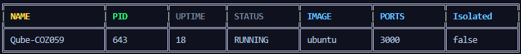

# Qube
[](https://github.com/Voyrox/Qube/graphs/contributors)
[](https://github.com/Voyrox/Qube/actions)

<p align="center">
  
</p>

## Features
- ✨ Lightweight and fast container runtime
- 🔒 Linux namespace isolation (PID, Mount, Network, IPC, UTS)
- 📊 CGroups v2 resource management (memory, CPU)
- 🚀 Simple CLI interface
- 🌐 REST API with WebSocket support
- 🐳 Docker-like workflow
- 📦 Prebuilt container images
- 🔧 QML configuration file support

## Quick Start

### Prerequisites

```bash
# Install Go 1.21+
sudo apt-get install golang-1.21  # Ubuntu/Debian
sudo pacman -S go                   # Arch/CachyOS

# Install dependencies
sudo apt-get install -y build-essential tar rsync
```

### Build & Install

```bash
# Clone repository
git clone https://github.com/Voyrox/Qube
cd Qube

# Build and install (Recommended for all users)
make install

# Or use build scripts
./scripts/build-go.fish --install  # Fish shell
./scripts/build-go.sh --install    # Bash
```

### Quick Example

```bash
# Start the daemon
sudo systemctl start qubed

# Run a Node.js container
sudo qube run --image Ubuntu24_NODE --ports 3000 --cmd "npm install && npm start"

# List running containers
sudo qube list

# View container info
sudo qube info <container_name>

# Stop a container
sudo qube stop <container_name>
```

## Build Commands

```bash
make build    # Build binary
make install  # Build and install
make clean    # Clean build artifacts
make test     # Run tests
make daemon   # Run daemon in debug mode
make deps     # Download dependencies
make fmt      # Format code
make lint     # Lint code
make release  # Build for multiple platforms
```

## Usage

### Run Container

```bash
# Basic usage
sudo qube run --image <image> --cmd "<command>"

# With ports and network isolation
sudo qube run --image Ubuntu24_NODE --ports 3000 --isolated --cmd "node server.js"

# With environment variables
sudo qube run --image Ubuntu24_PYTHON --env "DEBUG=true" --cmd "python app.py"

# With volume mounts
sudo qube run --image Ubuntu24_RUST --volume /host/path:/container/path --cmd "cargo run"
```

### Using QML Configuration

Create `qube.yml`:

```yaml
container:
  system: Ubuntu24_NODE
  ports:
    - "3000"
  cmd:
    - npm install
    - node index.js
  isolated: false
  environment:
    API_KEY: "your-key-here"
  volumes:
    - host_path: "/data"
      container_path: "/app/data"
```

Run with:

```bash
sudo qube run
```

### Available Commands

```bash
qube daemon         # Start daemon
qube run           # Run container
qube list          # List containers
qube stop <id>     # Stop container
qube start <id>    # Start container
qube delete <id>   # Delete container
qube eval <id>     # Execute command in container
qube info <id>     # Show container info
qube snapshot <id> # Create snapshot
```

### Prebuilt Images

- `Ubuntu24_Multi` - Node.js, Rust, Python3
- `Ubuntu24_NODE` - Node.js
- `Ubuntu24_RUST` - Rust
- `Ubuntu24_PYTHON` - Python3
- `Ubuntu24_GOLANG` - Go
- `Ubuntu24_JAVA` - Java

## API Endpoints

```bash
GET  /list              # List containers
POST /stop              # Stop container
POST /start             # Start container
POST /delete            # Delete container
POST /info              # Container info
GET  /images            # List images
GET  /volumes           # List volumes
WS   /eval              # WebSocket execution
```

## Development

```bash
# Format code
make fmt

# Run linter
make lint

# Run tests
make test

# Build with race detector
make dev

# Start daemon in debug mode
sudo qube daemon --debug
```

## System Requirements

- Linux kernel 3.10+
- CGroups v2 support
- Root privileges
- Go 1.21+ (for building)

## Troubleshooting

### Permission Denied

```bash
# Qube requires root
sudo qube <command>
```

### CGroup Errors

```bash
# Check cgroup version
mount | grep cgroup

# Should show cgroup2
```

### Build Errors

```bash
# Clean and rebuild
make clean
make deps
make build
```

## Contributing

1. Fork the repository
2. Create feature branch (`git checkout -b feature/amazing-feature`)
3. Format code (`make fmt`)
4. Run tests (`make test`)
5. Commit changes (`git commit -m 'Add amazing feature'`)
6. Push to branch (`git push origin feature/amazing-feature`)
7. Open Pull Request

## License

See LICENSE file

## Credits

- Qube team (Voyrox and contributors)
- Originally written in Rust, rewritten in Go for improved development experience

## Links

- [Documentation](docs/)
- [Issues](https://github.com/Voyrox/Qube/issues)
- [Discussions](https://github.com/Voyrox/Qube/discussions)
